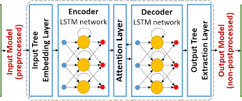
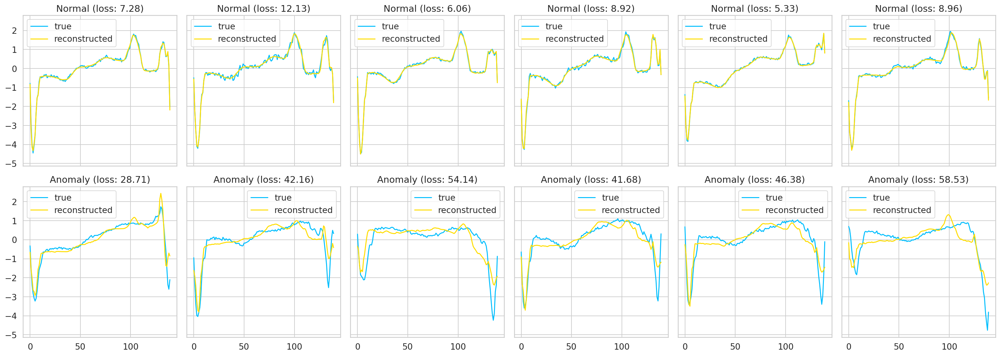

### Build an LSTM Autoencoder with Pytorch in Python

This will build an LSTM Autoencoder, train it on a set of normal heartbeats and classify unseen examples as normal or anomalies.

That step for detect abnormal hearbeats:
1. Prepare a dataset for Anomaly Detection from Time Series Data
2. To build an `LSTM Autoencoder with Pytorch`
3. Train and evaluate your model
4. Choose a threshold for anomaly detection
5. Classify unseen examples as normal or anomarly

## Preparing Data
Data source: http://timeseriesclassification.com/description.php?Dataset=ECG5000

The dataset contains 5000 Time Series examples (with ECG)
with 140 timesteps. Each sequence corresponds to a single heartbeat from a single patient with congestive heart failure.

An `ECG` measures and records the electrical activity that passes throught the heart. A doctor can determine if this electrical activity is normal or irregular.

Basically, we have 5 types of heartbeats(classes):
* Normal (N)
* R-on-T Premature Ventricular Contraction (R-on-T PVC)
* Premature Ventricular Contraction (PVC)
* Supra-ventricular Premature or Ectopic Beat (SP or EB)
* Unclassified Beat (UB)

Download data via bash script on Google Colab:
`!gdown --id 16MIleqoIr1vYxlGk4GKnGmrsCPuWkkpT`
`!unzip -qq ECG5000.zip`

Need to set up GPU on Google Colab:
`device = torch.device("cuda", if torch.cuda.is_available() else "cpu")`

### Installation ( based on Google Colab):

`!pip install -qq arff2pandas`
`!pip install -q -U watermark`
`!pip install -qq -U pandas`
`%reload_ext watermark
  %watermark -v -p numpy, pandas, torch, ardd2pandas`
  
  CPython 3.6.9
  IPython 5.5.0
  
  numpy 1.18.2
  pandas 1.0.3
  torch 1.4.0
  arff2pandas 1.0.1
  
### Data Preprocessing 

Using LSTM Autoencoder

 
 
The Autoencoder's process is to get some input data, pass it through the model, and obtain a reconstruction of the input. This is a tupe of `artificial neural network` used to learn `efficient data codings` is an `unsupervised` manner.

The aim of autoencoder is to learn a representation (encoding) for a set of data, typically for `dimensionality reduction` by training the network to ignore signal "noise"

### Time Series values to see normal and anomaly cases:
  
 
  

